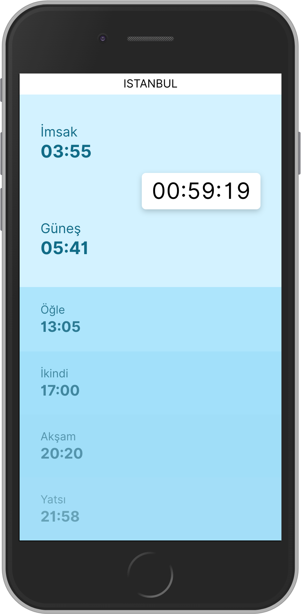
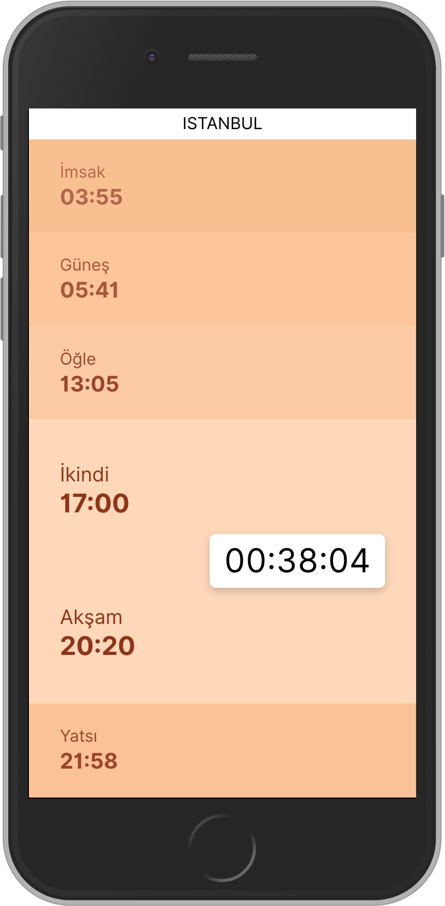

[](https://app.netlify.com/sites/prayer-times-khasavyurt/deploys)

# Prayer Times



```
// Project setup
yarn install

// Compiles and hot-reloads for development
yarn run serve

// Compiles and minifies for production
yarn run build
```
